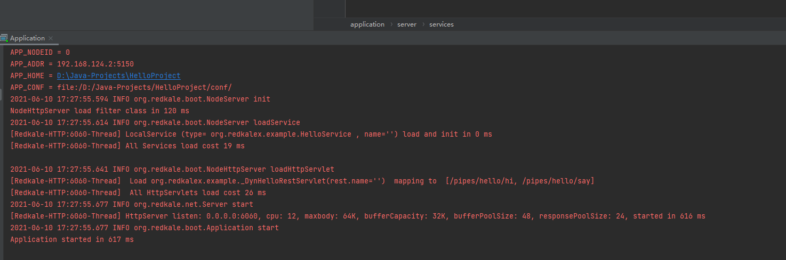

# 安装
使用maven:
```xml
<dependency>
    <groupId>org.redkale</groupId>
    <artifactId>redkale</artifactId>
    <version>2.8.0</version>
</dependency>
```
如果工程需要用到Redis、Kafka、Elasticsearch、SQL模板、模板引擎等，可使用redkale的官方插件:
```xml
<dependency>
    <groupId>org.redkalex</groupId>
    <artifactId>redkale-plugins</artifactId>
    <version>2.8.0</version>
</dependency>
```

# 创建工程
在IDE中使用ant或maven方式创建工程，增加redkale的依赖。下载解压

&nbsp;&nbsp;&nbsp;&nbsp;

并覆盖到工程目录下。
* bin： 存放启动/关闭脚本(start.sh、shutdown.sh、redkale.sh等)
* conf ： 存放服务器所需配置文件: 
* &nbsp;&nbsp;&nbsp;&nbsp;  application.xml： &nbsp;&nbsp;服务配置文件 (必需)； 
* &nbsp;&nbsp;&nbsp;&nbsp;  logging.properties：日志配置文件 (可选)； 
* &nbsp;&nbsp;&nbsp;&nbsp;  source.properties： 数据库配置文件 (可选)； 
* lib ： 存放服务所依赖jar 
* logs ： logging.properties配置中默认的日志存放目录。 


# Hello World

演示工程, 编写HelloService:
```java
package org.redkalex.example;

import org.redkale.net.http.*;
import org.redkale.service.Service;

@RestService(automapping = true)
public class HelloService implements Service {

    public String sayHello() {
        return "Hello World!";
    }

    public String hi(String name) {
        return "Hi, " + name + "!";
    }
}
```
运行结果:

&nbsp;&nbsp;&nbsp;&nbsp;

# 进一步阅读
* 详细的配置说明看[这里](config.md)。
* 数据源[这里](source.md)
