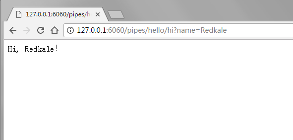

# 快速入门

## 安装

使用maven:

```markup
<dependency>
    <groupId>org.redkale</groupId>
    <artifactId>redkale</artifactId>
    <version>2.7.0</version>
</dependency>
```


&#x20;Super-powers are granted randomly so please submit an issue if you're not happy with yours.


如果工程需要用到Redis、Kafka、Elasticsearch、SQL模板、模板引擎等，可使用redkale的官方插件:

```markup
<dependency>
    <groupId>org.redkalex</groupId>
    <artifactId>redkale-plugins</artifactId>
    <version>2.7.0</version>
</dependency>
```


## 创建工程

在IDE中使用ant或maven方式创建工程，增加redkale的依赖。然后下载 <mark style="color:blue;">˚</mark> 解压并覆盖到工程目录下。\


.png>)

&#x20;  bin： 存放启动/关闭脚本(start.sh、shutdown.sh、redkale.sh等)\
conf ： 存放服务器所需配置文件: \
&#x20;               application.xml：     服务配置文件 (必需)； \
&#x20;               logging.properties：日志配置文件 (可选)； \
&#x20;               source.properties： 数据库配置文件 (可选)； \
&#x20;   lib ： 存放服务所依赖jar \
&#x20;logs ： logging.properties 配置中默认的日志存放目录。&#x20;

## Hello World

演示工程：

.png>)

.png>)

.png>)

下载 [redkale-2.7.0.tar.gz ](https://repo1.maven.org/maven2/org/redkale/redkale/2.7.0/redkale-2.7.0.tar.gz)解压并覆盖到工程目录下

.png>)

.png>)

编写HelloService:

```java
package org.redkalex.example;

import org.redkale.net.http.*;
import org.redkale.service.Service;

@RestService(automapping = true)
public class HelloService implements Service {

    public String sayHello() {
        return "Hello World!";
    }

    public String hi(String name) {
        return "Hi, " + name + "!";
    }
}
```

调试运行:&#x20;

.png>)

.png>)

.png>)

运行日志:

.png>)

在浏览器输入: http://127.0.0.1:6060/pipes/hello/say 可以看到结果：

.png>)

在浏览器输入: http://127.0.0.1:6060/pipes/hello/hi?name=Redkale 可以看到结果：




